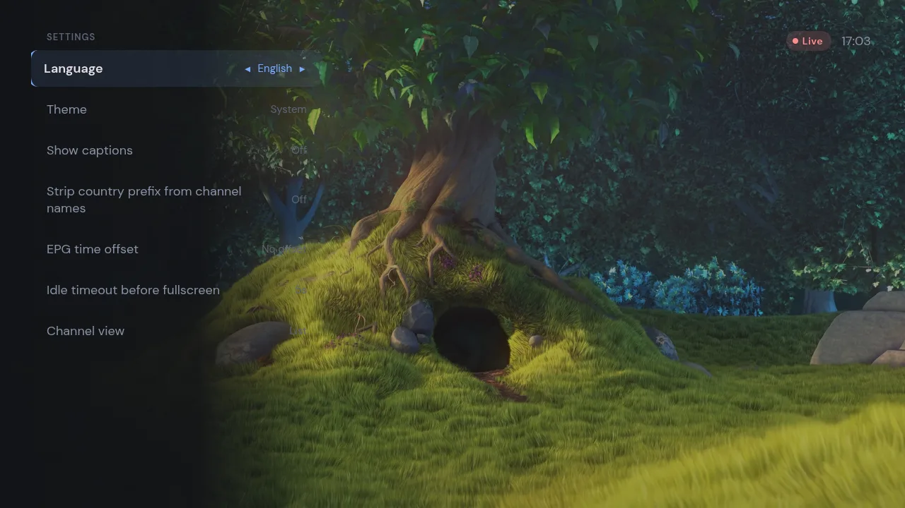
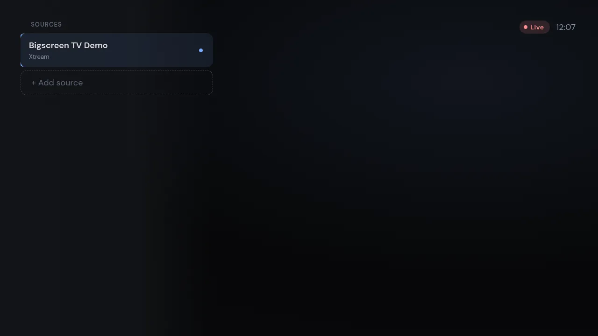
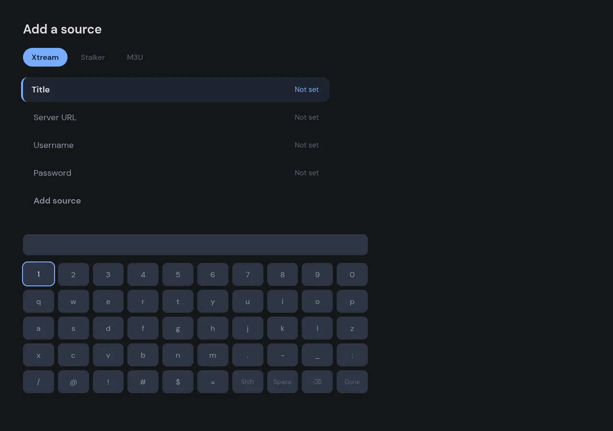

<p align="center">
  
</p>

<h1 align="center">IPTVnator Bigscreen Fork</h1>

<p align="center">
  A couch-and-remote-first fork of <a href="https://github.com/4gray/iptvnator">IPTVnator</a> — Live TV, EPG, and VOD built for the TV, not just the desktop.
</p>

<p align="center">
  <a href="./LICENSE.md"></a>
  <a href="https://github.com/4gray/iptvnator"></a>
</p>

## What this is

This is a personal fork of [**IPTVnator**](https://github.com/4gray/iptvnator)
(MIT-licensed, created by [4gray](https://github.com/4gray)) — it is **not
affiliated with or endorsed by** the upstream project. It exists to say so
factually, as permitted by upstream's own [`TRADEMARK.md`](./TRADEMARK.md).

It inherits the full upstream player — M3U/M3U8 playlists, Xtream Codes,
Stalker/Ministra portals, XMLTV EPG, VOD with TMDB enrichment, a download
manager, and more — and adds a dedicated **bigscreen/TV mode**
(`apps/tv`): a controller-first, D-pad/gamepad-driven interface meant to be
used from the couch with a remote instead of a mouse and keyboard, including:

- A full-screen Live TV view with instant preview-swap-on-focus
- A full-screen programme guide, scoped to the current category
- Numeric channel entry (type a channel number to jump straight to it)
- A Recently Viewed panel and per-source Recordings pane
- Live recording of the active channel, independent of the desktop player
- An on-screen keyboard for adding Xtream, Stalker, or M3U-by-URL sources
  with no physical keyboard required
- Full gamepad and keyboard input, side by side

⚠️ **This fork does not provide any playlists or other digital content.**
Any channels or artwork in screenshots are for demonstration purposes only.

> [!IMPORTANT]
> **No official builds exist yet for this fork** — it currently has to be
> built from source (see [Install](#install) below). For a maintained,
> officially distributed app, use upstream IPTVnator's own
> [website](https://4gray.github.io/iptvnator/) or
> [GitHub Releases](https://github.com/4gray/iptvnator/releases) — and
> beware of unofficial sites claiming to sell "IPTVnator" subscriptions or
> activated builds; see upstream's
> [Beware of unofficial IPTVnator websites and IPTV services](https://4gray.github.io/iptvnator/blog/beware-unofficial-iptvnator-websites/).


## Bigscreen / TV mode

TV mode ships inside the same desktop build as everything else — there's
nothing separate to install. To reach it:

1. Build and run the app (see [Install](#install)).
2. Open **Settings → General → TV mode** and enable it.
3. Restart the app. TV mode is selected at launch, so it takes effect on
   the next start.

TV mode is Electron-only (desktop), off by default, and lives alongside the
regular desktop UI — switch it back off the same way to return to the
standard workspace.

## Features

**Playlists & sources**

- M3U / M3U8 playlists from local files or remote URLs 📂, with automatic updates on startup
- Xtream Codes (XC) and Stalker / Ministra (STB) portal support
- Custom "User-Agent" header per playlist

**Playback**

- Built-in HTML5 player (HLS.js or Video.js) with a resizable, resumable inline view
- Optional unified controls for HTML5, Video.js, and ArtPlayer, enabled in **Settings → Playback** _(experimental)_
- External players — MPV, VLC, and IINA on macOS (`mpv.app` / `VLC.app` bundle paths supported) _(desktop)_
- Embedded MPV — native mpv rendered inside the app window on macOS, Windows & Linux 🖥️ _(experimental · desktop)_
- Dedicated radio player for `radio="true"` streams 📻

**Live TV & EPG**

- EPG / XMLTV TV guide with a live timeline ribbon and multi-channel grid _(desktop)_
- TV archive / catch-up / timeshift _(desktop)_
- Group-based channel list, channel-number selection, and search 🔍

**Movies & series (VOD)**

- Two-state detail pages (browse ↔ watch) with season tabs and resume positions
- Download manager for offline movies & episodes ⬇️ _(desktop)_
- "Recently added" feeds and category grids with sorting & pagination

**Discovery & metadata**

- Global search across live TV, movies, and series _(desktop)_
- TMDB enrichment (opt-in, requires your own TMDB API key) — plots, cast & crew, trailers, ratings, artwork, a "Similar" rail, clickable actor pages, and a trending dashboard rail _(trending rail: desktop)_
- Dashboard with recently watched & continue-watching

**Organization**

- Per-playlist and global favorites, aggregated across all playlists ⭐
- Recently viewed / watch history
- Command palette (`Ctrl/Cmd+K`)

**Bigscreen / TV mode** (`apps/tv`, desktop only)

- Controller-first Live TV screen — real playback, gamepad or keyboard
- Full-screen programme guide scoped to the current category
- Numeric channel entry across the whole active source
- Recently Viewed panel and a play-only Recordings pane
- Live recording independent of the desktop player's Embedded MPV recorder
- On-screen keyboard for adding sources with no physical keyboard
- Subtitle (captions) toggle for the first embedded HLS track

**Platform**

- Cross-platform desktop (Electron) and installable PWA
- Desktop auto-updater and mobile remote control _(desktop)_
- Docker self-hosting for the PWA + web backend
- 19 languages ([translation files](apps/web/src/assets/i18n/)), light & dark themes, and keyboard shortcuts

## Keyboard shortcuts

Press `?` or `Shift+/` in the workspace to open the in-app shortcuts list.

| Area              | Shortcut                    | Action                                                     |
| ----------------- | ---------------------------- | ------------------------------------------------------------ |
| Global            | `Ctrl/Cmd+K`                 | Open command palette                                          |
| Global            | `Ctrl/Cmd+F`                 | Open global search in the desktop app                         |
| Global            | `Ctrl/Cmd+R`                 | Open recently viewed in the desktop app                       |
| Global            | `Enter` in workspace search  | Submit the current search                                     |
| Global            | `F11`                        | Toggle app window fullscreen in the desktop app                |
| Navigation        | `Ctrl/Cmd+B`                 | Toggle the live sidebar                                        |
| Navigation        | `0-9`                        | Select an M3U channel by number                                |
| Playback          | `Space` / `K`                | Play or pause playback                                         |
| Playback          | `F`                          | Toggle player fullscreen                                       |
| Playback          | `ArrowLeft` / `ArrowRight`   | Seek VOD playback by 5 seconds                                 |
| Playback          | `ArrowUp` / `ArrowDown`      | Adjust volume by 5%                                             |
| Playback          | `M`                          | Mute audio                                                      |
| Dialogs and lists | `ArrowUp` / `ArrowDown`      | Move command palette selection                                  |
| Dialogs and lists | `Enter`                      | Run the selected command or open a focused item                 |
| Dialogs and lists | `Escape`                     | Close dialogs and dismiss overlays                              |

The desktop app can also open at its last size, maximized, or fullscreen on
every launch (Settings → General → "Window on startup"), and `iptvnator
--fullscreen` forces a single fullscreen launch for TV or HTPC autostart
scripts without changing that setting.

## Screenshots

|                                     Dashboard with recently watched content                                     |                               Live channels with inline player and EPG                                |
| :-------------------------------------------------------------------------------------------------------------: | :---------------------------------------------------------------------------------------------------: |
|        |  |
|                                Add playlist dialog for M3U, Xtream, and Stalker                                 |                                      Live category channel list                                       |
|         |                    |
|                                Global search across live TV, movies, and series                                 |                                    Manage visible live categories                                     |
|        |            |
|                                 Movie category grid with sorting and pagination                                 |                                   Recently added movies and series                                    |
|  |      |
|                                 VOD details with playback and download actions                                  |                                           Download manager                                            |
|            |                           |
|                                             Multi-channel EPG grid                                              |                                      External MPV player support                                      |
|                                 |     |
|                                   Radio playback with dedicated audio player                                    |                                              Light theme                                              |
|              |                                     |
|                                              Application settings                                               |                                                                                                       |
|                                         |                                                                                                       |

_These screenshots are from the shared desktop UI this fork inherits._

### Bigscreen / TV mode screenshots

|                              Full-screen Live TV                              |                          Settings, D-pad navigable                          |
| :-----------------------------------------------------------------------------: | :---------------------------------------------------------------------------: |
|  |  |
|                                Source switcher                                |                    Add a source with the on-screen keyboard                     |
|    |  |

## Install

There is no packaged download for this fork yet — build it from source.
It takes about a minute on a modern machine.

Requirements:

- Node.js 22.22.3 or newer within 22.x, or 24.15.0 or newer within 24.x
  (see [`.nvmrc`](.nvmrc))
- pnpm 10.33.0 (via Corepack)

```bash
git clone https://github.com/WilliamMorgan73/iptvnator.git
cd iptvnator
nvm install && nvm use   # optional, matches CI's Node version
corepack enable
pnpm install
pnpm run serve:backend
```

This opens the Electron app in its own window (Angular dev server runs at
<http://localhost:4200> alongside it). To enable the bigscreen experience,
see [Bigscreen / TV mode](#bigscreen--tv-mode) above.

To produce a distributable build instead of running in dev mode:

```bash
pnpm run package:app   # unpacked distributable
pnpm run make:app      # installers/executables for your platform
```

Full developer setup, environment flags, and debugging options are in
[How to Build and Develop](#how-to-build-and-develop) below.

### Want the official, packaged app instead?

If you don't need this fork's TV-mode changes, upstream IPTVnator ships
maintained, prebuilt installers for macOS, Windows, and Linux from their own
[release page](https://github.com/4gray/iptvnator/releases), plus package
managers:

```shell
# Homebrew (macOS/Linux)
brew install iptvnator

# Snap (Linux)
sudo snap install iptvnator

# Arch Linux (AUR)
yay -S iptvnator-bin
```

See upstream's [README](https://github.com/4gray/iptvnator#readme) for
Gentoo, Docker, and nightly-build instructions — those are their release
channels, not this fork's.

### Linux Embedded MPV support

Embedded MPV on Linux is experimental and currently supports x64 desktop
sessions where the app runs under X11 or Xwayland. Native Wayland embedding
is not supported yet. A locally built app requests X11 with
`--ozone-platform=x11`, so Wayland desktops still need Xwayland available.

The Linux backend starts a system `mpv` executable with `--wid`, so `mpv`
must be installed and available on `PATH`.

## Self-hosted PWA

The Docker setup builds the Angular PWA and the monorepo web backend into one
image. The backend handles remote M3U parsing plus Xtream and Stalker proxy
requests under `/api`, so a separate backend container is not required for
the default self-hosted flow.

```bash
docker compose -f docker/docker-compose.yml up --build -d
```

The application is available at <http://localhost:4333>. See
[`docker/docker-compose.yml`](./docker/docker-compose.yml) for the ready-to-run
compose file and [`docker/README.md`](./docker/README.md) for environment
variables, reverse proxy notes, PWA limitations, and build details.

The self-hosted image runs the browser PWA rather than the Electron desktop
app: EPG/XMLTV panels, Embedded MPV, managed MPV/VLC launching, the download
manager, TV mode, and Electron remote-control features are not available
there (TV mode is Electron-only). If browser playback fails, copy the stream
URL and open it manually in an external player such as MPV, VLC, or IINA.

## Troubleshooting

### macOS: "App is damaged and can't be opened"

Unsigned local builds may require removing the quarantine flag from the
built application:

```bash
xattr -c /Applications/IPTVnator.app
```

Alternatively, if the app is located in a different directory:

```bash
xattr -c ~/Downloads/IPTVnator.app
```

### Linux: chrome-sandbox Issues

If you encounter the following error when launching the app:

```
The SUID sandbox helper binary was found, but is not configured correctly.
Rather than run without sandboxing I'm aborting now.
You need to make sure that chrome-sandbox is owned by root and has mode 4755.
```

**Solution 1: Fix chrome-sandbox permissions (Recommended for .deb/.rpm installations)**

Navigate to the installation directory and run:

```bash
sudo chown root:root chrome-sandbox
sudo chmod 4755 chrome-sandbox
```

**Solution 2: Launch with --no-sandbox flag**

Edit the desktop launcher file to add the `--no-sandbox` flag:

1. Find your desktop file location:
    - **Ubuntu/Debian**: `~/.local/share/applications/iptvnator.desktop`
    - **System-wide**: `/usr/share/applications/iptvnator.desktop`

2. Edit the file and modify the `Exec` line:

    ```
    Exec=iptvnator --no-sandbox %U
    ```

3. Save the file and relaunch the application from your application menu.

Alternatively, you can launch from the terminal with the flag:

```bash
iptvnator --no-sandbox
```

### GNU/Linux: Wayland startup failure

If the app exits on GNU/Linux with errors about failing to connect to
Wayland or initialize the Ozone platform, force X11/XWayland instead:

```bash
iptvnator --ozone-platform=x11
```

This workaround is mainly for older or problematic Linux graphics stacks.

## Tech stack

| Layer          | Technology                                                                          |
| -------------- | ------------------------------------------------------------------------------------ |
| Monorepo/build | [Nx](https://nx.dev) 23 workspace (`@nx/angular`, `@nx/esbuild`, `@nx/jest`, `@nx/playwright`, …), pnpm |
| Frontend       | [Angular](https://angular.dev) 22 (signal-based components), [NgRx](https://ngrx.io) Store + NgRx Signal Store |
| Desktop        | [Electron](https://www.electronjs.org/) 43, electron-builder                        |
| Data           | [Drizzle ORM](https://orm.drizzle.team/) + `better-sqlite3` (desktop), IndexedDB via `ngx-indexed-db` (PWA) |
| Playback       | HLS.js, Video.js, [ArtPlayer](https://artplayer.org/), Shaka Player (DASH), an embedded native MPV addon |
| Testing        | Jest, [Playwright](https://playwright.dev/)                                          |
| Website        | Astro + Tailwind CSS                                                                 |

## How to Build and Develop

Requirements:

- Node.js 22.22.3 or newer within 22.x, or 24.15.0 or newer within 24.x
- pnpm 10.33.0 (via Corepack)

The repository's `.nvmrc` pins the Node.js version used by CI. With nvm,
run `nvm install` and `nvm use` from the repository root to use the same version
for local development.

1. Clone this repository and install project dependencies:

    ```
    $ nvm install
    $ nvm use
    $ corepack enable
    $ pnpm install
    ```

2. Start the application:
    ```
    $ pnpm run serve:backend
    ```

This will open the Electron app in a separate window, while the Angular dev server will run at http://localhost:4200.

The equivalent Nx command is:

```
$ nx serve electron-backend
```

To start Electron with an empty, isolated data directory instead of your normal
`~/.iptvnator` folder, set `IPTVNATOR_E2E_DATA_DIR` for that run:

```
$ rm -rf .tmp/iptvnator-empty && mkdir -p .tmp/iptvnator-empty
$ IPTVNATOR_E2E_DATA_DIR="$PWD/.tmp/iptvnator-empty" pnpm run serve:backend
```

This redirects the SQLite database, Electron user data, and local config under
the given directory. Delete that directory whenever you want a fresh empty
state.

If you need startup diagnostics for a white screen or a frozen route, you can
also turn on opt-in Electron tracing. These logs are written to the Electron
terminal output so they still help when the renderer DevTools never open:

```
$ IPTVNATOR_TRACE_STARTUP=1 pnpm run serve:backend
```

Nx equivalent:

```
$ IPTVNATOR_TRACE_STARTUP=1 nx serve electron-backend
```

Useful narrower flags:

- `IPTVNATOR_TRACE_IPC=1` logs renderer `window.electron.*` calls reaching the
  Electron bridge
- `IPTVNATOR_TRACE_DB=1` logs DB worker requests and request-scoped DB events
- `IPTVNATOR_TRACE_SQL=1` logs SQLite statements in both the main connection and
  DB worker connection
- `IPTVNATOR_TRACE_WINDOW=1` logs BrowserWindow load, navigation, and
  unresponsive events
- `IPTVNATOR_TRACE_RENDERER_CONSOLE=1` mirrors renderer console messages into
  the Electron terminal output

Security-sensitive network compatibility flags are opt-in:

- `IPTVNATOR_ALLOW_PRIVATE_NETWORK_URLS=1` permits strict EPG fetches from
  playlist metadata (`x-tvg-url`, `url-tvg`, or `tvg-url`) to resolve to
  localhost, LAN, or other private addresses. Directly configured
  Xtream/Stalker portals and private playlist servers remain supported without
  this flag. Prefer the in-app source-scoped “Allow source” action for a trusted
  EPG URL.
- `IPTVNATOR_ALLOW_INSECURE_TLS=1` disables certificate validation for remote
  playlist imports and refreshes for the whole Electron process. Prefer the
  in-app host-scoped trust action for a trusted provider with a self-signed or
  otherwise invalid certificate.

If the local Nx daemon gets into a bad state before rerunning Electron, reset it:

```
$ pnpm nx reset
```

To run only the Angular app without Electron, use:

```
$ pnpm run serve:frontend
```

## Disclaimer

**This project doesn't provide any playlists or other digital content.**

## Trademark

This fork does not use the name **"IPTVnator"** or the IPTVnator logo as its
own identity — the name and logo/icon artwork are unregistered trademarks of
the upstream project owner, and the MIT license covers the source code only,
not the branding. Stating that this project is "a fork of IPTVnator" is a
factual, permitted reference. See upstream's [`TRADEMARK.md`](./TRADEMARK.md)
for the full notice.
